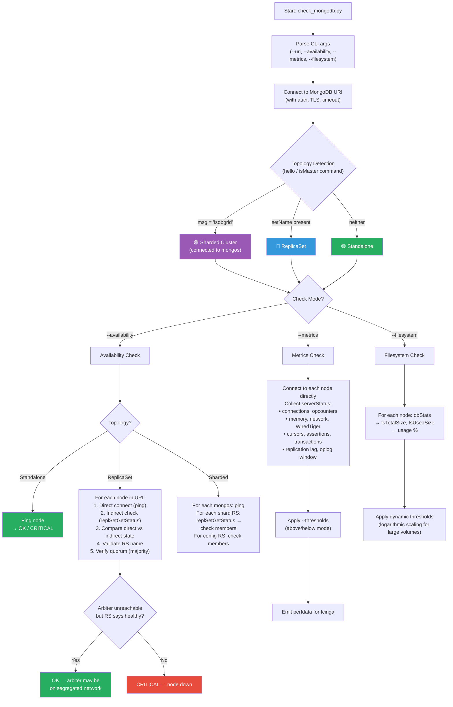

# check_mongodb — Icinga Plugin for MongoDB


Monolithic Python plugin for monitoring on-prem MongoDB instances via Icinga/Nagios.

Supports: **Standalone**, **ReplicaSet**, **ReplicaSet with Arbiter**, **Sharded Cluster**.

## How It Works

The plugin automatically detects the MongoDB topology and adapts its checks accordingly.



## Requirements

| Requirement | Version |
|---|---|
| Python | ≥ 3.8 |
| pymongo | ≥ 4.0, < 5.0 |
| dnspython | ≥ 2.0 |
| MongoDB | 5.x — 8.2 |

### Installation

```bash
pip install -r requirements.txt
```

For development and testing:

```bash
pip install -r requirements-dev.txt
```

## Check Modes

The script supports **3 mutually exclusive modes**:

### `--availability` — Node Availability

Verifies that all nodes are reachable and in a healthy state.

- **Direct check**: connects directly to each node declared in the URI
- **Indirect check**: queries `replSetGetStatus` to compare the state seen by the cluster vs the state seen by Icinga
- **Validation**: verifies that the ReplicaSet name matches the one in the URI
- **Quorum**: verifies that majority is maintained for writes
- **Arbiter**: if the arbiter is not directly reachable but rsStatus reports it as healthy → OK (it may be on a segregated network)

**Severity**:
- Any data-bearing node down → **CRITICAL**
- RS name mismatch → **CRITICAL**
- Node reachable but RS reports anomalous state → **CRITICAL**
- Quorum lost → **CRITICAL**

```bash
# ReplicaSet
./check_mongodb.py --uri "mongodb://host1:27017,host2:27017,host3:27017/?replicaSet=myRS" \
    --availability --username admin --password secret

# Sharded Cluster
./check_mongodb.py --uri "mongodb://mongos1:27017,mongos2:27017/" \
    --availability --tls
```

### `--metrics` — Performance Metrics

Connects DIRECTLY to each node to collect metrics from `serverStatus`.

| Metric | Threshold key via `--thresholds` |
|---|---|
| Connection usage % | `conn_usage_pct` (above) |
| Replication lag | `repl_lag` (above, seconds) |
| Oplog window | `oplog_window` (below, hours) |
| WiredTiger cache usage % | `cache_usage_pct` (above) |
| WiredTiger tickets read/write % | `tickets_read_pct`, `tickets_write_pct` (above) |
| Queue total | `queue_total` (above) |
| Cursors open / timed out | `cursor_open`, `cursor_timed_out` (above) |
| Assertions | `assertions_regular`, `assertions_warning` (above) |
| Operations/sec, memory, network, document ops, page faults, active clients, database sizes, filesystem, oplog size, transactions | Perfdata only |

> **⚠️ Oplog window**: thresholds are **inverted** (mode `below`): the alert fires when the window drops **below** the configured value.

> **⚠️ WiredTiger tickets**: in MongoDB 7.0+ the pool is dynamic (max 128). Thresholds use **usage %** so they work with both fixed and dynamic pools.

```bash
./check_mongodb.py --uri "mongodb://host1:27017,host2:27017/?replicaSet=rs0" \
    --metrics --thresholds '{
      "conn_usage_pct": {"warning": 80, "critical": 90},
      "oplog_window":   {"warning": 48, "critical": 24, "mode": "below"},
      "tickets_read_pct":  {"warning": 80, "critical": 95},
      "tickets_write_pct": {"warning": 80, "critical": 95},
      "repl_lag":        {"warning": 30, "critical": 120}
    }'
```

### `--filesystem` — Filesystem Usage

Checks disk space via `dbStats` (`fsTotalSize` / `fsUsedSize`).

**Dynamic thresholds (logarithmic formula)**: on large volumes the percentage threshold is automatically adjusted to require more free space in absolute terms.

| Volume | Base threshold 90% | Free space required |
|---|---|---|
| 100 GB | 90% | 10 GB |
| 1 TB | ~93% | ~70 GB |
| 5 TB | ~95% | ~250 GB |
| 10 TB | ~96% | ~400 GB |

```bash
./check_mongodb.py --uri "mongodb://host1:27017,host2:27017/" \
    --filesystem --thresholds '{"fs_usage_pct": {"warning": 85, "critical": 95}}'
```

## Parameters

| Parameter | Description | Default |
|---|---|---|
| `--uri` | MongoDB connection string | **required** |
| `--username`, `-u` | Authentication username | — |
| `--password`, `-p` | Authentication password | — |
| `--auth-mechanism` | `SCRAM-SHA-256`, `SCRAM-SHA-1`, `PLAIN` (LDAP) | auto |
| `--auth-source` | Authentication database | `admin` (`$external` for LDAP) |
| `--tls` | Enable TLS/SSL | `false` |
| `--tls-insecure` | Disable TLS certificate verification | `false` |
| `--timeout` | Connection timeout (seconds) | `10` |
| `--thresholds` | JSON with per-metric thresholds (see above) | — |
| `--replicaset` | Expected RS name (overrides URI) | — |
| `--verbose`, `-v` | Verbose output for debugging | `false` |
| `--version` | Show script version | — |

## Exit Codes

| Code | Status | Description |
|---|---|---|
| 0 | OK | Everything is working correctly |
| 1 | WARNING | Warning threshold exceeded |
| 2 | CRITICAL | Node(s) down, critical threshold exceeded, severe error |
| 3 | UNKNOWN | Plugin error or unsupported check |

## Performance Data

Output includes perfdata in standard Nagios format:

```
STATUS - message | label=value[UOM];warn;crit;min;max
```

Labels use the format `<host>_<port>_<metric>` to uniquely identify each metric per node.

## Icinga2 Configuration

Example `CheckCommand`:

```
object CheckCommand "mongodb" {
    command = [ PluginDir + "/check_mongodb.py" ]

    arguments = {
        "--uri" = "$mongodb_uri$"
        "--username" = {
            value = "$mongodb_username$"
            set_if = {{ macro("$mongodb_username$") != false }}
        }
        "--password" = {
            value = "$mongodb_password$"
            set_if = {{ macro("$mongodb_password$") != false }}
        }
        "--auth-mechanism" = {
            value = "$mongodb_auth_mechanism$"
            set_if = {{ macro("$mongodb_auth_mechanism$") != false }}
        }
        "--tls" = {
            set_if = "$mongodb_tls$"
        }
        "--availability" = {
            set_if = "$mongodb_check_availability$"
        }
        "--metrics" = {
            set_if = "$mongodb_check_metrics$"
        }
        "--filesystem" = {
            set_if = "$mongodb_check_filesystem$"
        }

        "--timeout" = {
            value = "$mongodb_timeout$"
            set_if = {{ macro("$mongodb_timeout$") != false }}
        }
        "--replicaset" = {
            value = "$mongodb_replicaset$"
            set_if = {{ macro("$mongodb_replicaset$") != false }}
        }
        "--verbose" = {
            set_if = "$mongodb_verbose$"
        }
        "--thresholds" = {
            value = "$mongodb_thresholds$"
            set_if = {{ macro("$mongodb_thresholds$") != false }}
        }
    }
}
```

Example `Service`:

```
apply Service "mongodb-availability" {
    check_command = "mongodb"
    vars.mongodb_uri = "mongodb://host1:27017,host2:27017,host3:27017/?replicaSet=myRS"
    vars.mongodb_check_availability = true
    vars.mongodb_username = "icinga"
    vars.mongodb_password = "secret"
    vars.mongodb_tls = true
    check_interval = 1m
    retry_interval = 30s
    assign where host.vars.role == "mongodb"
}
```

## Testing

### Unit Tests

```bash
python -m pytest tests/test_check_mongodb.py -v
```

### End-to-End Tests (requires Docker)

The E2E tests run inside a temporary Docker container attached to the `docker_mongonet` network. This ensures the test runner can resolve the MongoDB hostnames (`mongo1`, `mongos1`, etc.) defined in the Compose files.

**Helper Script (`run_e2e.sh`)**:
This script automates the process:
1.  Builds/pulls a lightweight Python image.
2.  Mounts the current directory.
3.  Installs dependencies.
4.  Runs `pytest` inside the container.

```bash
# 1. Start test environment (choose one)
docker compose -f docker/docker-compose.replicaset-7.0.yml up -d
# or
docker compose -f docker/docker-compose.sharded-5.0.yml up -d

# 2. Wait for initialization (approx 30s)
sleep 30

# 3. Run tests using the helper script
./run_e2e.sh -v

# Run a single test
./run_e2e.sh -v -k test_availability_quorum_lost

# Cleanup
# Cleanup
docker compose -f docker/docker-compose.replicaset-7.0.yml down -v
```

### Fault Injection

```bash
# Stop a node
./tests/fault_injection.sh stop-node mongo2

# Simulate network partition
./tests/fault_injection.sh network-partition mongo2

# Restore
./tests/fault_injection.sh start-node mongo2
./tests/fault_injection.sh restore-network mongo2
```

## Docker Test Environments

| File | Topology |
|---|---|
| `docker/docker-compose.single-7.0.yml` | Standalone MongoDB 7.0 |
| `docker/docker-compose.replicaset-7.0.yml` | 3-node ReplicaSet MongoDB 7.0 |
| `docker/docker-compose.replicaset-arbiter-7.0.yml` | 2 data + 1 arbiter MongoDB 7.0 |
| `docker/docker-compose.sharded-7.0.yml` | Full sharded cluster MongoDB 7.0 |
| `docker/docker-compose.single-5.0.yml` | Standalone MongoDB 5.0 |
| `docker/docker-compose.replicaset-5.0.yml` | 3-node ReplicaSet MongoDB 5.0 |
| `docker/docker-compose.replicaset-arbiter-5.0.yml` | 2 data + 1 arbiter MongoDB 5.0 |
| `docker/docker-compose.sharded-5.0.yml` | Full sharded cluster MongoDB 5.0 |

## License

MIT
